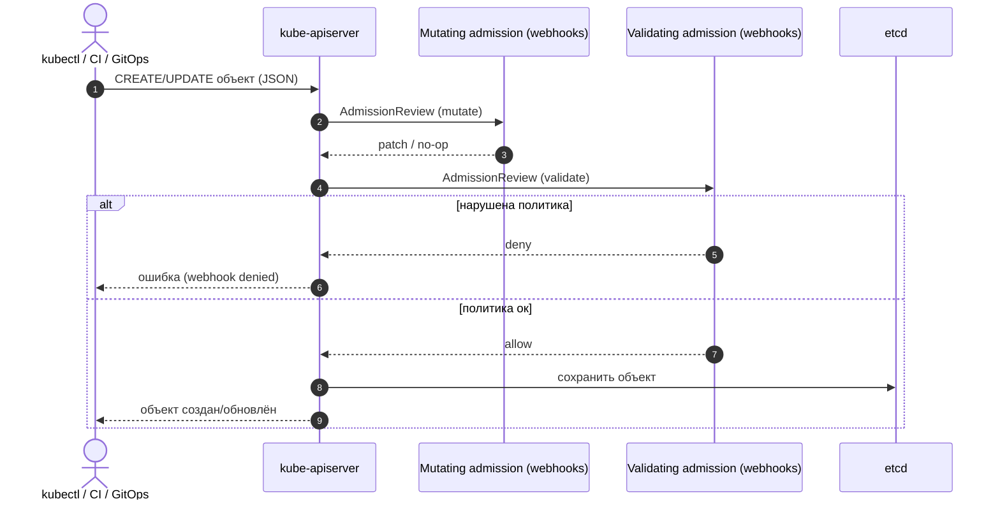

# LESSONS

## Урок 1

### Задание

Сделать минимальный сервис и подготовить его к запуску в Kubernetes (kind).

### Требования

- **REST API (FastAPI)**: реализовать CRUD для сущности **Игрок**.
- **Хранилище**: использовать SQLite (локальная БД в файле).
- **Docker**: собрать Docker-образ приложения.
- **Kubernetes (kind)**: создать/запустить локальный кластер kind и подготовить манифесты для деплоя.

### Результат (что должно получиться)

- **Код сервиса** находится в `app/`, запуск локально через `uvicorn app.main:app`.
- **Docker-образ** собирается командой `docker build -t player-api:<tag> .` (лучше не использовать `latest`).
- **Манифесты Kubernetes** лежат в `k8s/` и применяются через `kubectl apply -f k8s/`.
- После запуска доступен `GET /health`, который возвращает `{"status":"ok"}`.

### Полезные команды (k8s)

- **Проверить контекст kubectl** (важно, если есть и `docker-desktop`, и `kind`):
  - `kubectl config current-context`
  - `kubectl config get-contexts`
  - `kubectl config use-context kind-kind`

## Урок 1.1

### Задание: Authentication (JWT)

Добавить в сервис базовую аутентификацию, чтобы CRUD-эндпоинты были доступны только авторизованным пользователям.

### Требования

- **Регистрация**: `POST /auth/register` принимает `username`, `email`, `password` и создаёт игрока.
- **Логин**: `POST /auth/token` выдаёт `access_token` (JWT, Bearer).
- **Защита API**: эндпоинты `/players` должны требовать заголовок `Authorization: Bearer <token>`.
- **Секрет**: ключ подписи JWT задаётся через переменную окружения `SECRET_KEY` (в k8s — через env/Secret).

### Результат (что должно получиться)

- Можно зарегистрироваться, получить токен и затем выполнить запросы к `/players` с Bearer‑токеном.

### Полезные команды (Swagger/OpenAPI)

- **Посмотреть OpenAPI**: `curl http://localhost:8000/openapi.json`
- **Быстро проверить наличие auth-путей**:
  - `curl -s http://localhost:8000/openapi.json | grep -Eo '"/auth/[^"]+' | head`

### Полезные команды (релиз в kind “по‑правильному”)

Идея: используем **immutable tag** и обновляем `Deployment` на конкретную версию.

```bash
export TAG="v1.1.1"
docker build -t player-api:$TAG .
kind load docker-image player-api:$TAG --name kind

kubectl config use-context kind-kind
kubectl set image deployment/player-api player-api=player-api:$TAG
kubectl rollout status deployment/player-api
```

## Урок 1.2

### Тема: Authorization (права доступа)

Цель: научиться отличать **authentication** (кто ты) от **authorization** (что тебе можно) и реализовать простую модель прав.

### Задание (практика)

Реализуй роли и правила доступа к API.

#### Роли

- **admin**: может управлять всеми игроками
- **user**: может читать/менять только “себя”

#### Требования к данным

- Добавить игроку поле **role** (например: `admin` | `user`)
- Определить, как назначается роль при регистрации:
  - по умолчанию `user`
  - (опционально) отдельный способ сделать первого админом через env (например `BOOTSTRAP_ADMIN_USERNAME`)

#### Правила доступа (обязательно)

- **GET /players**
  - `admin`: видит всех
  - `user`: видит только себя (или вернуть 403 — выбери один вариант)
- **GET /players/{id}**
  - `admin`: доступ к любому `id`
  - `user`: доступ только к своему `id`
- **PUT/PATCH /players/{id}**
  - `admin`: может менять `username/email` любого игрока
  - `user`: может менять только свои `username/email`
- **DELETE /players/{id}**
  - `admin`: может удалять любого
  - `user`: запрещено (403) либо разрешено только “себя” (выбери и зафиксируй)

#### Ограничения безопасности

- Запретить пользователю менять роль через публичные эндпоинты.
- При ошибке прав возвращать **403 Forbidden**.

### Что должно получиться (критерии готовности)

- В Swagger понятно, какие эндпоинты требуют токен.
- Можно зарегистрировать двух пользователей: `admin` и `user`, получить токены и проверить, что правила выше реально работают.
- Покрыть минимум ручными проверками через `curl`:
  - `user` не может читать чужого игрока
  - `user` не может удалять чужого игрока (и в зависимости от правила — даже себя)
  - `admin` может читать/обновлять/удалять любого

### Acceptance tests (обязательно)

Добавить acceptance tests для кейса `admin` vs `user`.

- **Локально (in-memory)**:
  - `pip install -r requirements-dev.txt`
  - `pytest -q`
- **E2E против кластера** (через `kubectl port-forward` на `http://localhost:8000`):
  - `kubectl port-forward svc/player-api 8000:80`
  - `BASE_URL="http://localhost:8000" BOOTSTRAP_ADMIN_KEY="<key>" pytest -q -m e2e`

## Урок 1.3

### Тема: Authentication/Authorization на Ingress (NGINX Ingress Controller)

Цель: вынести **проверку “входа”** (наличие/валидность токена) на уровень k8s через Ingress NGINX, чтобы неавторизованные запросы отсеивались до приложения.

Важно: “authorization по данным” (например, user может читать только себя) обычно остаётся в сервисе.

### Задание (практика)

- Установить **NGINX Ingress Controller** в kind.
- Добавить `Ingress` для `player-api`.
- Настроить проверку авторизации на уровне Ingress:
  - **вариант A (минимальный)**: `nginx.ingress.kubernetes.io/auth-url` + отдельный эндпоинт проверки токена
  - **вариант B (расширенный)**: oauth2-proxy + OIDC (например GitHub/Google/Keycloak)

### Как сделать вариант A (минимальный) — пошагово

#### 1) Создать kind-кластер с пробросом портов 80/443

> Если у тебя уже есть кластер kind без проброса портов — проще пересоздать его для этого урока.

```bash
kind delete cluster --name kind || true
kind create cluster --name kind --config k8s/kind-config-ingress.yaml
kubectl config use-context kind-kind
kubectl get nodes
```

#### 2) Установить NGINX Ingress Controller (ingress-nginx)

```bash
kubectl apply -f https://raw.githubusercontent.com/kubernetes/ingress-nginx/controller-v1.11.1/deploy/static/provider/kind/deploy.yaml

kubectl -n ingress-nginx wait --for=condition=ready pod \
  -l app.kubernetes.io/component=controller \
  --timeout=180s
```

Проверка, что Ingress Controller поднялся:

```bash
kubectl -n ingress-nginx get pods
kubectl get ingressclass
```

Если используешь аннотации вида `nginx.ingress.kubernetes.io/auth-snippet` (как в `k8s/ingress.yaml`), включи snippet-аннотации (в kind для урока ок):

```bash
kubectl -n ingress-nginx patch configmap ingress-nginx-controller --type merge \
  -p '{"data":{"allow-snippet-annotations":"true"}}'
kubectl -n ingress-nginx rollout restart deployment/ingress-nginx-controller
kubectl -n ingress-nginx rollout status deployment/ingress-nginx-controller --timeout=180s
```

#### 3) Задеплоить сервис и Ingress

```bash
# (если нужно) собрать образ и загрузить в kind
export TAG="v1.1.0"
docker build -t player-api:$TAG .
kind load docker-image player-api:$TAG --name kind

kubectl apply -f k8s/deployment.yaml -f k8s/service.yaml -f k8s/ingress.yaml
kubectl rollout status deployment/player-api
kubectl get ingress
```

#### 4) Проверить, что auth “режется” на Ingress

`/health` должен быть доступен без токена:

```bash
curl -i http://127.0.0.1/health
```

Создаём пользователя и берём токен через Ingress (путь публичный):

```bash
curl -i -X POST http://127.0.0.1/auth/register \
  -H "Content-Type: application/json" \
  -d '{"username":"player1","email":"player1@example.com","password":"verysecret123"}'

TOKEN="$(curl -s -X POST http://127.0.0.1/auth/token \
  -H "Content-Type: application/x-www-form-urlencoded" \
  -d "username=player1&password=verysecret123" | python3 -c 'import sys, json; print(json.load(sys.stdin)["access_token"])')"
echo "$TOKEN"
```

Без токена `/players` должен вернуть **401/403** (ответ сформирован Ingress-ом):

```bash
curl -i http://127.0.0.1/players
```

С токеном — запрос проходит в приложение:

```bash
curl -i http://127.0.0.1/players -H "Authorization: Bearer $TOKEN"
```

### Минимальные требования

- `GET /health` доступен без авторизации.
- Все запросы к `/players` требуют авторизации на уровне Ingress:
  - без `Authorization: Bearer ...` должно возвращаться **401/403** от Ingress
  - с токеном — запрос проходит до приложения

### Что должно получиться (критерии готовности)

- В кластере есть ресурсы Ingress Controller и `Ingress` для сервиса.
- Проверка через `curl`:
  - `/health` → 200 без токена
  - `/players` → 401/403 без токена (ответ сформирован Ingress)
  - `/players` → 200 с токеном

## Урок 1.4

### Тема: Admission Controllers (mutating / validating)

Цель: понять, как Kubernetes **перехватывает запросы к API** *до сохранения объекта в etcd* и может:

- **мутировать** объект (изменить JSON/YAML запроса);
- **валидировать** объект (разрешить/запретить создание/обновление).

Практически это чаще всего выглядит как **Dynamic Admission Control**: `MutatingWebhookConfiguration` / `ValidatingWebhookConfiguration`, которые вызывают HTTPS‑endpoint (webhook‑сервер) внутри кластера.

### Зачем это нужно (мотивация и use case)

Уроки **1.1–1.3** про то, как **фильтровать HTTP‑трафик** к приложению (JWT, роли, Ingress auth). **Admission** — про другое: как **фильтровать/нормализовать объекты Kubernetes** на границе API (манифесты из `kubectl`, Helm, CI, GitOps).

Типовая боль без admission: “плохой” объект часто **успевает сохраниться**, после чего его ловят уже **поздними** механизмами (ошибки в Pod’ах, security‑сканирование образов постфактум, ручные разборы). Admission позволяет сделать **ранний guardrail**: *не пускать* нарушения и/или *автоматически поправить* запрос до того, как он станет “истиной” кластера.

Практические сценарии (очень коротко):

- **Безопасность/комплаенс**: запретить `privileged`, hostPath, “опасные” capabilities, неизвестные registry, mutable теги вроде `:latest`.
- **Стандарты платформы**: всегда добавить label/annotation (команда/кост‑центр), выставить дефолты (resources, `imagePullPolicy`), включить обязательные sidecars.
- **Согласованность GitOps/CI**: одинаковые правила для человека и для пайплайна (всё равно идёт через apiserver).

Как это стыкуется с уроком **1.3**: Ingress может отрезать HTTP‑запросы, но **не заменяет** политики на уровне API (например, кто‑то всё равно может попытаться создать “плохой” `Pod` напрямую). Admission — слой **cluster‑policy** вокруг Kubernetes API.

Ниже — “сквозная” схема потока запроса (упрощённо):



> Подсказка: диаграммы Mermaid обычно нормально рендерятся на GitHub. Если смотришь `LESSONS.md` в редакторе без Mermaid‑превью — это всё равно валидный текст, а картинки есть на странице [Lesson 1 — Admission](./docs/lesson1.html#admission).

### Задание (практика)

Сделай “сквозной” пример на kind:

- Установи **Kyverno** (это policy‑engine поверх admission webhooks; для учебного сценария удобнее, чем писать свой webhook с нуля).
- Включи **две политики**:
  - **mutating**: автоматически добавить label (например `foo=bar`) к `ConfigMap` (и/или другим объектам).
  - **validating**: запретить образы с тегом `:latest` на уровне `Pod` (в т.ч. для `Deployment`/`Job`, потому что они создают `Pod`).

> Альтернатива “с нуля”: написать свой admission webhook (Deployment + Service + TLS + `*WebhookConfiguration`). Это отличное углубление, но обычно отдельная большая тема.

### Пошагово (рекомендуемый путь через Kyverno)

#### 1) Убедись, что контекст кластера — kind

```bash
kubectl config current-context
kubectl get ns
```

#### 2) Установить Kyverno

Используй **тегированный** релиз (не `main`), например:

```bash
kubectl create namespace kyverno || true

# Вариант A (как в документации Kyverno): kubectl create -f ...
kubectl apply -f https://github.com/kyverno/kyverno/releases/download/v1.17.1/install.yaml

kubectl -n kyverno wait --for=condition=available deployment/kyverno-admission-controller --timeout=300s
kubectl -n kyverno get pods
```

Проверка, что webhooks реально зарегистрированы:

```bash
kubectl get mutatingwebhookconfiguration,validatingwebhookconfiguration | grep -i kyverno || true
```

#### 3) Применить mutate‑policy (добавить label)

Возьми готовый пример из policy library Kyverno:

- `https://raw.githubusercontent.com/kyverno/policies/main/other/add-labels/add-labels.yaml`

```bash
kubectl apply -f https://raw.githubusercontent.com/kyverno/policies/main/other/add-labels/add-labels.yaml
kubectl get clusterpolicy add-labels
```

#### 4) Применить validate‑policy (запрет `:latest`) и включить enforce

Возьми готовый пример:

- `https://raw.githubusercontent.com/kyverno/policies/main/best-practices/disallow-latest-tag/disallow-latest-tag.yaml`

```bash
kubectl apply -f https://raw.githubusercontent.com/kyverno/policies/main/best-practices/disallow-latest-tag/disallow-latest-tag.yaml

# По умолчанию в этом примере часто стоит Audit — для учебной “жёсткой” проверки включи Enforce:
kubectl patch clusterpolicy disallow-latest-tag --type merge -p '{"spec":{"validationFailureAction":"Enforce"}}'

kubectl get clusterpolicy disallow-latest-tag
```

### Проверка результата (kubectl)

#### Mutating: объект реально изменяется admission’ом

Проверка без создания объекта (server dry-run):

```bash
kubectl create configmap kyverno-mutate-demo \
  --from-literal=k=v \
  --dry-run=server -o yaml | grep -F "foo: bar"
```

Ожидаемо: строка `foo: bar` присутствует (её добавил mutating webhook).

#### Validating: запрос отклоняется на API

```bash
# Должно упасть (запрещён :latest)
kubectl create deployment kyverno-validate-demo \
  --image=nginx:latest \
  --dry-run=server
```

```bash
# Должно пройти (конкретный тег без :latest)
kubectl create deployment kyverno-validate-demo-ok \
  --image=docker.io/library/nginx:1.27.0 \
  --dry-run=server
```

### Минимальные требования

- В кластере установлен Kyverno, видны webhook‑конфигурации.
- Есть **работающая** mutating‑политика (по факту — изменение манифеста на admission).
- Есть **работающая** validating‑политика в режиме **Enforce** (отказ `kubectl ... --dry-run=server` для `:latest`).

### Что должно получиться (критерии готовности)

- Ты можешь объяснить разницу:
  - **mutating** срабатывает раньше и может **изменить** запрос;
  - **validating** принимает решение **да/нет** (обычно уже после мутаций).
- Ты умеешь быстро диагностировать проблемы admission:
  - `kubectl get validatingwebhookconfiguration,mutatingwebhookconfiguration`
  - `kubectl -n kyverno logs deploy/kyverno-admission-controller`
  - при ошибках создания ресурса: `kubectl describe <resource>` (в Events часто видно `denied`/`failed calling webhook`).

### Полезные ссылки

- Kyverno installation (YAML): `https://kyverno.io/docs/installation/installation/`
- Policy library: `https://kyverno.io/policies/`


